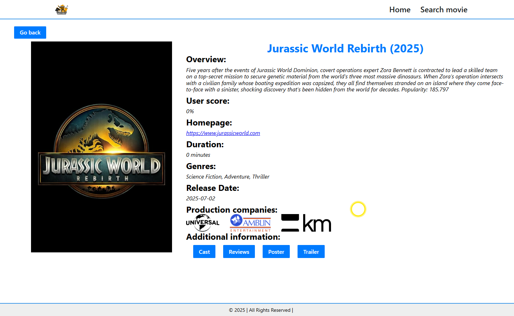

# best-movies

## Стек технологій

## Опис проекту

`"best-movies"` - пошук кіно, розроблений для швидкого та зручного знаходження фільмів в Інтернеті,
незалежно від того, чи шукаєте новинки, класику кінематографу чи просто щось цікаве для перегляду.

`Основні функції:`

1. Популярні та нові фільми: знайомтесь із найпопулярнішими та найновішими фільмами на головній
   сторінці.

2. Швидкий пошук: дозволяє знаходити та переглядати інформацію про різноманітні фільми та акторів.

3. Детальна інформація: отримуйте повну інформацію про кожен фільм, включаючи жанр, акторський
   склад, опис сюжету, перегляд трейлеру, постерів ...

4. Актори та ролі: інформація про акторів та їхні ролі у стрічці.

5. Відгуки: рейтинги від інших користувачів.

`Посилання на сайт:` https://best-movies-jet.vercel.app/
